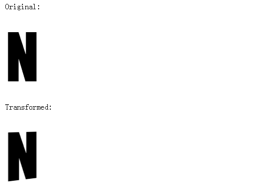
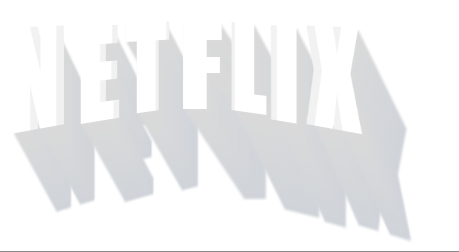

*The following is a guest post by Gregor Adams about how he managed to re-create the Netflix logo in CSS. Gregor is kind of the rising star when it comes to CSS, so needless to say it is a great honor to have him here.*<br/>
*这篇博客是 [Gregor Adams](https://twitter.com/gregoradams) 讲他如何用 CSS 重现 Netflix 商标效果。Gregor 当他涉足 CSS 方面时是 star 增速冠军。能在这里谈论他也是非常荣誉的。*<p>
A few months ago I tested Netflix, immediately got hooked and got myself an account. I started watching a lot of series that I usually had to view elsewhere. Each episode or movie starts with the Netflix logo animation.<br/>
我尝试使用 Netflix（译者注：一家在线影片租赁提供商）时，立即就把我迷住了。我观看了一些我已经看过的节目。每一集电视剧或者电影都已 Netflix 动画作为开始。<p>
<p>
I immediately started thinking about implementing this in CSS. So after watching a few episodes I went over to CodePen and started to work on the logo.<br/>
在观看了几集电视剧之后，我忽然想到可以用 CSS 来实现 Netflix 的 logo 动画，于是我来到了 [CodePen](http://codepen.io/pixelass/)。<p>
###第一个概念/First concept
My first implementation was a little dirty since I was trying a few things.<br/>
我的第一个实施方式是有点累赘的，因为我尝试采用新技术。<p>
For example: I wanted to do this in pure CSS and I also wanted to be able to run the animation again when I click a button, so I had to use some magic. Luckily I always have a few tricks up my sleeve when it comes to CSS.<br/>
例如：我想使用纯 CSS 技术来实现它，并且我也想当我点击按钮的时候，这个动画在执行一次，所以我要使用一些不可思议技巧。幸运的是当我写 CSS 代码的时候，总会有一些窍门出现在我的大脑里。<p>
But let’s talk about the actual animation.<br/>
我们来谈论一下实际的动画。<p>
I recorded the logo and looped it in Quicktime so I could examine it in detail. I tend to do that a lot because it allows me to stop at certain frames to figure out what is actually going on.<br/>
我录下这个动画并且在 Quicktime 中循环播放，这样我可以详细检查。我倾向于这么做，因为它允许我停在某些特定帧弄清楚到底发生了什么。<p>
The logo:<br/>
这个商标：<br/>
starts with a white screen;<br/>
1.以一个白屏幕开始。</br>
pops out as white 3d letters;<br/>
2.弹出白色的 3D 字母。</br>
throws a shadow;</br>
3.投射阴影。</br>
fades back;</br>
4.消失。</br>
changes the font color to red.</br>
5.把字体颜色变成红色。</br>

So these were the animation steps I needed to replicate. But there is something else about the logo that I needed to take care of: the letters are tilted to the center of the logo.<br/>
这就是我需要实现的动画步骤。但是这里有另外一些关于这个 logo 的东西需要解决：**字母在商标中心是倾斜的。**<p>
People have been asking me how I did that…<br/>
大家一直问我如何做到这些。<p>
A trick from up my sleeve ;)<br/>
*从积累中获取的*<br/>
I do a lot of 3d experiments, so this wasn’t that much of a difficulty to me.<br/>
我做了许多 3D 实验，所以这对我来说不是很难。<p>
###使字母变倾斜/Deforming/Tilting the letters
I started with some basic markup for the word “Netflix”<br/>
以这个词 “Netflix” 的一些基本标记开始。<p>
```
<div class="logo">
  <span>N</span>
  <span>E</span>
  <span>T</span>
  <span>F</span>
  <span>L</span>
  <span>I</span>
  <span>X</span>
</div>
```
I made a wrapper with the class logo and wrapped each letter in a span.<br/>
我用类<code>logo</code>做了一个包装，并且用<code>span</code>标签包裹每一个字母。<p>
Then I rotated the letters on the y-axis and scaled them on the x-axis to retain its original width. The important part is setting a perspective on the wrapper and defining its perspective-origin.<br/>
然后我在Y轴上旋转这个字母并且在 X 轴上缩放这个字母以保持它的原始宽度。重要的部分是在<code> class="logo"</code>包装上设置一个<code>perspective </code>，并且定义它的<code> perspective-origi</code>。
```
// 基础的字母样式
span {
  font-size: 8em;
  font-family: impact;
  display: block;
}
// 开启三维效果
.logo {
  perspective: 1000px;
  perspective-origin: 50% 0;
}

//给字母变换
.logo span {
  transform-origin: 0 0;
  transform: scaleX(80) rotateY(89.5deg);
}
```
There are different way of doing this, like using a different perspective (e.g. 500px), rotation-angle (e.g. 9deg) and scale value (e.g. 0.5) but these values turned out to work the best for my needs.<br/>
这里还有一些其它的方式来实现这些，例如使用一个不同景深（比如500px），旋转角度（比如9deg）和缩放（比如0.5），但是这些值能实现我最需要的效果。<p>
Here’s a demo on CodePen:<br/>
下面是在 CODEPEN 实现的小例子：（原demo是页面中嵌入的iframe实现嵌入CODEPEN，但是markdown没有嵌入iframe的方法，所以采用代码段来展示，并且把原demo的jade和scss写法转换成css方便没有使用过两种技术的读者阅读）<p>
*jade实现*
```
div(class="fig--1")
  style. 
    @import 'http://codepen.io/pixelass/pen/raEojV.css';
  p Original:
  span N
  p Transformed:
  .logo
    span N
```
*html实现*
```
<div class="fig--1">
  <style>@import 'http://codepen.io/pixelass/pen/raEojV.css';</style>
  <p>Original:</p><span>N</span>
  <p>Transformed:</p>
  <div class="logo"><span>N</span></div>
</div>
```
*scss实现*
```
.fig--1 {
  span {
    font-size: 8em;
    font-family: Impact, Haettenschweiler, 'Arial Narrow Bold', sans-serif;
    display: block;
  }
  .logo {
    perspective: 1000px;
    perspective-origin: 50% 0;
    span {
      transform-origin: 0 0;
      transform: scaleX(80) rotateY(89.5deg);
    }
  }
}
```
*css实现*
```
.fig--1 span {
  font-size: 8em;
  font-family: Impact, Haettenschweiler, 'Arial Narrow Bold', sans-serif;
  display: block;
}
.fig--1 .logo {
  perspective: 1000px;
  perspective-origin: 50% 0;
}
.fig--1 .logo span {
  transform-origin: 0 0;
  transform: scaleX(80) rotateY(89.5deg);
}
```
*实际效果*<p>
<p>
Next I had to apply this to all the letters respecting that the middle letter is not transformed, the ones to the right are tilted in the opposite direction and the height of the letters changes.<br/>
接下来我要对所有的字母应用这个样式，中间的字母不要变化。右边的字母朝着相反的方向倾斜，并且字母高度发生变化。<p>
To do this I needed to add some logic: I use Sass with the SCSS syntax to do this.<br/>
为了实现这些需要增加一些新逻辑：我使用 Sass 的标准语法来实现。<p>
*scss代码*
```
.logo {
  perspective: 1000px;
  perspective-origin: 50% 0;
  font-size: 8em;
  display: inline-flex;

  span {
    font-family: impact;
    display: block;

    $letters: 7;
    @for $i from 1 through $letters {
      $offset: $i - ceil($letters / 2);
      $trans: if($offset > 0, -89.5deg, 89.5deg);

      &:nth-child(#{$i}) {
        // trans/de-form the letters
        transform-origin: 50% + 50%/$offset 200%;
        font-size: if($offset == 0,
          0.85em,
          0.9em + 0.015*pow(abs($offset),2));
        transform:
            if($offset == 0, scale(1, 1), scale(95.9 - abs($offset) * 10, 1))
            if($offset == 0, translatey(0%), rotatey($trans));
      }
    }
  }
}
```
*为了方便不懂 scss 同学立即，这是我编译后的 css 代码*
```
.logo {
  perspective: 1000px;
  perspective-origin: 50% 0;
  font-size: 8em;
  display: inline-flex;
}
.logo span {
  font-family: impact;
  display: block;
}
.logo span:nth-child(1) {
  transform-origin: 33.33333333% 200%;
  font-size: 1.035em;
  transform: scale(65.9, 1) rotatey(89.5deg);
}
.logo span:nth-child(2) {
  transform-origin: 25% 200%;
  font-size: 0.96em;
  transform: scale(75.9, 1) rotatey(89.5deg);
}
.logo span:nth-child(3) {
  transform-origin: 0% 200%;
  font-size: 0.915em;
  transform: scale(85.9, 1) rotatey(89.5deg);
}
.logo span:nth-child(4) {
  transform-origin: Infinity% 200%;
  font-size: 0.85em;
  transform: scale(1, 1) translatey(0%);
}
.logo span:nth-child(5) {
  transform-origin: 100% 200%;
  font-size: 0.915em;
  transform: scale(85.9, 1) rotatey(-89.5deg);
}
.logo span:nth-child(6) {
  transform-origin: 75% 200%;
  font-size: 0.96em;
  transform: scale(75.9, 1) rotatey(-89.5deg);
}
.logo span:nth-child(7) {
  transform-origin: 66.66666667% 200%;
  font-size: 1.035em;
  transform: scale(65.9, 1) rotatey(-89.5deg);
}
```
Here’s a demo on CodePen<br/>
这里是 demo 代码块（译者注：原demo是页面中嵌入的iframe实现嵌入CodePen，但是markdown没有嵌入iframe的方法，所以采用代码段来展示，并且把原demo的jade和scss写法转换成css方便没有使用过两种技术的读者阅读）<p>
*jade*
```
div(class="fig--2")
  style. 
    @import 'http://codepen.io/pixelass/pen/yydGPL.css';
  .logo
    span N
    span E
    span T
    span F
    span L
    span I
    span X
```
*html*
```
<div class="fig--2">
  <style>@import 'http://codepen.io/pixelass/pen/yydGPL.css';</style>
  <div class="logo">
    <span>N</span>
    <span>E</span>
    <span>T</span>
    <span>F</span>
    <span>L</span>
    <span>I</span>
    <span>X</span>
  </div>
</div>
```
*scss*
```
.fig--2 .logo {
  perspective: 1000px;
  perspective-origin: 50% 0;
  font-size: 8em;
  display: inline-flex;
}
.fig--2 .logo span {
  font-family: Impact, Haettenschweiler, 'Arial Narrow Bold', sans-serif;
  display: block;
}
.fig--2 .logo span:nth-child(1) {
  transform-origin: 33.33333333% 200%;
  font-size: 1.035em;
  transform: scale(65.9, 1) rotatey(89.5deg);
}
.fig--2 .logo span:nth-child(2) {
  transform-origin: 25% 200%;
  font-size: 0.96em;
  transform: scale(75.9, 1) rotatey(89.5deg);
}
.fig--2 .logo span:nth-child(3) {
  transform-origin: 0% 200%;
  font-size: 0.915em;
  transform: scale(85.9, 1) rotatey(89.5deg);
}
.fig--2 .logo span:nth-child(4) {
  transform-origin: Infinity% 200%;
  font-size: 0.85em;
  transform: scale(1, 1) translatey(0%);
}
.fig--2 .logo span:nth-child(5) {
  transform-origin: 100% 200%;
  font-size: 0.915em;
  transform: scale(85.9, 1) rotatey(-89.5deg);
}
.fig--2 .logo span:nth-child(6) {
  transform-origin: 75% 200%;
  font-size: 0.96em;
  transform: scale(75.9, 1) rotatey(-89.5deg);
}
.fig--2 .logo span:nth-child(7) {
  transform-origin: 66.66666667% 200%;
  font-size: 1.035em;
  transform: scale(65.9, 1) rotatey(-89.5deg);
}

```
*css*
```
.fig--2 .logo {
  perspective: 1000px;
  perspective-origin: 50% 0;
  font-size: 8em;
  display: inline-flex;
}
.fig--2 .logo span {
  font-family: Impact, Haettenschweiler, 'Arial Narrow Bold', sans-serif;
  display: block;
}
.fig--2 .logo span:nth-child(1) {
  transform-origin: 33.33333333% 200%;
  font-size: 1.035em;
  transform: scale(65.9, 1) rotatey(89.5deg);
}
.fig--2 .logo span:nth-child(2) {
  transform-origin: 25% 200%;
  font-size: 0.96em;
  transform: scale(75.9, 1) rotatey(89.5deg);
}
.fig--2 .logo span:nth-child(3) {
  transform-origin: 0% 200%;
  font-size: 0.915em;
  transform: scale(85.9, 1) rotatey(89.5deg);
}
.fig--2 .logo span:nth-child(4) {
  transform-origin: Infinity% 200%;
  font-size: 0.85em;
  transform: scale(1, 1) translatey(0%);
}
.fig--2 .logo span:nth-child(5) {
  transform-origin: 100% 200%;
  font-size: 0.915em;
  transform: scale(85.9, 1) rotatey(-89.5deg);
}
.fig--2 .logo span:nth-child(6) {
  transform-origin: 75% 200%;
  font-size: 0.96em;
  transform: scale(75.9, 1) rotatey(-89.5deg);
}
.fig--2 .logo span:nth-child(7) {
  transform-origin: 66.66666667% 200%;
  font-size: 1.035em;
  transform: scale(65.9, 1) rotatey(-89.5deg);
}
```
*实际效果*<p>
<p>

###一个用于阴影的函数/A function for the shadow
Let’s write a function for the 3d-effect and the shadow. I paused on one frame of the video I had made before and looked at it in detail.<br/>
写一个实现 3d 效果和阴影的函数。我把视频停在某一帧，并且仔细查看细节。<p>.
<p>
As you can see the 3d effect’s vanishing point is in the center while the shadow drops to the bottom right. Now we know what our function has to be able to do.<br/>
正如你所看到的，当这个阴影到达右下角，3d 效果的消失点在中间。现在知道我们函数需要做什么了。<p>
We will call this function inside keyframes so we want it to be able to handle a few values like:<br/>
我们将会在 keyframes 中调用这个函数，所以我们希望他能处理一些值，例如：<br>
<ul>
  <li>color</li>
  <li>x</li>
  <li>y</li>
  <li>blur</li>
  <li>mix</li>
</ul>
We need one more argument to define the depth of the shadow or 3d-effect.<br/>
我们还需要一个参数来定义阴影的深度或者 3d 效果。<p>
<p>
Here’s the function I am using to handle all these requirements:<br/>
下面就是用来处理这些需求的函数：<p>
```
/// 在特定方向创创建三维阴影
/// @author Gregor Adams
/// @param  {Number}        $depth - 阴影长度
/// @param  {Unit}          $color - 阴影颜色
/// @param  {Unit}          $x     - 在x轴上到下一个阴影的距离
/// @param  {Unit}          $y     - 在y轴上到下一个阴影的距离
/// @param  {Unit}          $blur  - text-shadow的模糊距离
/// @param  {Color|false}   $mix   - 添加一个可选的颜色来混合
/// @return {List}          - 返回text-shadow列表
@function d3($depth, $color, $x: 1px, $y: 1px, $blur: 0, $mix: false) {
  $shadow: ();
  @for $i from 1 through $depth {
    // append to the existing shadow
    @if type-of($mix) != 'color' {
      $shadow: append($shadow, round($i * $x) round($i * $y) $blur $color, comma);

    } @else {
      $shadow: append($shadow, round($i * $x) round($i * $y) $blur mix($mix, $color, 0.3%*$i), comma);
    }
  }
  @return $shadow;
}
```
This function might be a little hard to understand for Sass-noobs or developers/designers that only use the basic features of the language, so let me explain it in detail.<br/>
这个函数对于 Sass 菜鸟或者只使用基本语言特性的开发者和设计师来说可能有点难理解，所以让我来详细解释一下.<p>
I start off with a variable I called $shadow. It is an empty list.<br/>
我以一个<code>$shadow</code>的变量开始，<code>list</code> 是一个空的列表。
```
$shadow: ();
```
I am looping from 1 through the depth. through in Sass means that we iterate including this value.<br/>
我是从1开始循环到列表的深度。在 Sass 中 through 会使迭代器迭代到 depth 这个值
<ul>
  <li>from 0 to 5 = 0, 1, 2, 3, 4</li>
  <li>from 0 through 5 = 0, 1, 2, 3, 4, 5</li>
</ul>
In each iteration I append a text-shadow to the list. So in the end the variable looks something like this:<br/>
每一次迭代我都添加一个 text-shadow 到这个列表。所以最后这个列表看起来就是下面这个样子：<br/>
```
$shadow: (0 1px 0 red, 1px 2px 0 red, 2px 3px 0 red, ...);
```
… and I use it like this:<br/>
使用的时候就像下面这样：<br/>
```
text-shadow: d3(5, red, [$x], [$y], [$blur], [$mix]);
```
$x, $y, $blur and $mix are optional arguments. I already mentioned that I will call this function inside keyframes so I need to be able to optionally change them. $mix will allow to add a second color so the shadow fades from one to the other.<br/>
$x,$y,$blur 和 $mix 都是可选的参数。我已经提到我将会在 keyframes 中调用这个函数，所以我需要可选择性的改变他们。 $mix 允许添加第二个颜色，实现这个阴影从一种颜色淡出成另外一种颜色。<p>
Here’s a demo on CodePen:<br/>
下面是例子：
*jade*
```
div(class="fig--3")
  style. 
    @import 'http://codepen.io/pixelass/pen/XJLOXg.css';
  .logo
    span N
    span E
    span T
    span F
    span L
    span I
    span X
  p(style="height: 50px")
```
*html*
```
<div class="fig--3">
  <style>@import 'http://codepen.io/pixelass/pen/XJLOXg.css';</style>
  <div class="logo">
    <span>N</span>
    <span>E</span>
    <span>T</span>
    <span>F</span>
    <span>L</span>
    <span>I</span>
    <span>X</span>
  </div>
  <p style="height: 50px"></p>
</div>
```
*scss*
```
/// Create a 3d-shadow in a certain direction
/// @author Gregor Adams
/// @param  {Number}        $depth - 阴影长度
/// @param  {Unit}          $color - 阴影颜色
/// @param  {Unit}          $x     - 在x轴上到下一个阴影的距离
/// @param  {Unit}          $y     - 在y轴上到下一个阴影的距离
/// @param  {Unit}          $blur  - text-shadow的模糊距离
/// @param  {Color|false}   $mix   - 添加一个可选的颜色来混合
/// @return {List}          - 返回一个text-shadow列表
@function d3($depth, $color, $x: 1px, $y: 1px, $blur: 0, $mix: false) {
  $shadow: ();
  @for $i from 1 through $depth {
    // append to the existing shadow
    @if type-of($mix) != 'color' {
      $shadow: append($shadow, round($i * $x) round($i * $y) $blur $color, comma);
    } @else {
      $shadow: append($shadow, round($i * $x) round($i * $y) $blur mix($mix,$color,0.3%*$i), comma);
    }
  }
  @return $shadow;
}
$c_fg:         #f00;
$c_bg:         #fff;
$c_3d:         #f2f2f2;
$c_shadow:     #dadada;
$c_shadow-mix: #6998da;
.fig--3 {
  .logo {
    perspective: 1000px;
    perspective-origin: 50% 0;
    font-size: 8em;
    display: inline-flex;
    span {
      font-family: Impact, Haettenschweiler, 'Arial Narrow Bold', sans-serif;
      display: block;
      color: $c_bg;
      $letters: 7;
      @for $i from 1 through $letters {
        $offset: $i - ceil($letters / 2);
        $trans: if($offset > 0, -89.5deg, 89.5deg);
        &:nth-child(#{$i}) {
          // trans/de-form the letters
          transform-origin: 50% + 50%/$offset 200%;
          font-size: if($offset == 0,
            0.85em,
            0.9em + 0.015*pow(abs($offset),2));
          transform: 
              if($offset == 0, scale(1, 1), scale(95.9 - abs($offset) * 10, 1)) 
              if($offset == 0, translatey(0%), rotatey($trans));
           text-shadow: 
            d3(15, $c_3d, if($offset == 0, 0, -0.25px * $offset), 0), 
            d3(30, $c_shadow, 2px, 3px, 3px, $c_shadow-mix);
        }
      }
    }
  }
}
```
*css*
```
.fig--3 .logo {
  perspective: 1000px;
  perspective-origin: 50% 0;
  font-size: 8em;
  display: inline-flex;
}
.fig--3 .logo span {
  font-family: Impact, Haettenschweiler, 'Arial Narrow Bold', sans-serif;
  display: block;
  color: #fff;
}
.fig--3 .logo span:nth-child(1) {
  transform-origin: 33.33333% 200%;
  font-size: 1.035em;
  transform: scale(65.9, 1) rotatey(89.5deg);
  text-shadow: 1px 0 0 #f2f2f2, 2px 0 0 #f2f2f2, 2px 0 0 #f2f2f2, 3px 0 0 #f2f2f2, 4px 0 0 #f2f2f2, 5px 0 0 #f2f2f2, 5px 0 0 #f2f2f2, 6px 0 0 #f2f2f2, 7px 0 0 #f2f2f2, 8px 0 0 #f2f2f2, 8px 0 0 #f2f2f2, 9px 0 0 #f2f2f2, 10px 0 0 #f2f2f2, 11px 0 0 #f2f2f2, 11px 0 0 #f2f2f2, 2px 3px 3px #dadada, 4px 6px 3px #d9dada, 6px 9px 3px #d9d9da, 8px 12px 3px #d9d9da, 10px 15px 3px #d8d9da, 12px 18px 3px #d8d9da, 14px 21px 3px #d8d9da, 16px 24px 3px #d7d8da, 18px 27px 3px #d7d8da, 20px 30px 3px #d7d8da, 22px 33px 3px #d6d8da, 24px 36px 3px #d6d8da, 26px 39px 3px #d6d7da, 28px 42px 3px #d5d7da, 30px 45px 3px #d5d7da, 32px 48px 3px #d5d7da, 34px 51px 3px #d4d7da, 36px 54px 3px #d4d6da, 38px 57px 3px #d4d6da, 40px 60px 3px #d3d6da, 42px 63px 3px #d3d6da, 44px 66px 3px #d3d6da, 46px 69px 3px #d2d5da, 48px 72px 3px #d2d5da, 50px 75px 3px #d2d5da, 52px 78px 3px #d1d5da, 54px 81px 3px #d1d5da, 56px 84px 3px #d1d4da, 58px 87px 3px #d0d4da, 60px 90px 3px #d0d4da;
}
.fig--3 .logo span:nth-child(2) {
  transform-origin: 25% 200%;
  font-size: 0.96em;
  transform: scale(75.9, 1) rotatey(89.5deg);
  text-shadow: 1px 0 0 #f2f2f2, 1px 0 0 #f2f2f2, 2px 0 0 #f2f2f2, 2px 0 0 #f2f2f2, 3px 0 0 #f2f2f2, 3px 0 0 #f2f2f2, 4px 0 0 #f2f2f2, 4px 0 0 #f2f2f2, 5px 0 0 #f2f2f2, 5px 0 0 #f2f2f2, 6px 0 0 #f2f2f2, 6px 0 0 #f2f2f2, 7px 0 0 #f2f2f2, 7px 0 0 #f2f2f2, 8px 0 0 #f2f2f2, 2px 3px 3px #dadada, 4px 6px 3px #d9dada, 6px 9px 3px #d9d9da, 8px 12px 3px #d9d9da, 10px 15px 3px #d8d9da, 12px 18px 3px #d8d9da, 14px 21px 3px #d8d9da, 16px 24px 3px #d7d8da, 18px 27px 3px #d7d8da, 20px 30px 3px #d7d8da, 22px 33px 3px #d6d8da, 24px 36px 3px #d6d8da, 26px 39px 3px #d6d7da, 28px 42px 3px #d5d7da, 30px 45px 3px #d5d7da, 32px 48px 3px #d5d7da, 34px 51px 3px #d4d7da, 36px 54px 3px #d4d6da, 38px 57px 3px #d4d6da, 40px 60px 3px #d3d6da, 42px 63px 3px #d3d6da, 44px 66px 3px #d3d6da, 46px 69px 3px #d2d5da, 48px 72px 3px #d2d5da, 50px 75px 3px #d2d5da, 52px 78px 3px #d1d5da, 54px 81px 3px #d1d5da, 56px 84px 3px #d1d4da, 58px 87px 3px #d0d4da, 60px 90px 3px #d0d4da;
}
.fig--3 .logo span:nth-child(3) {
  transform-origin: 0% 200%;
  font-size: 0.915em;
  transform: scale(85.9, 1) rotatey(89.5deg);
  text-shadow: 0px 0 0 #f2f2f2, 1px 0 0 #f2f2f2, 1px 0 0 #f2f2f2, 1px 0 0 #f2f2f2, 1px 0 0 #f2f2f2, 2px 0 0 #f2f2f2, 2px 0 0 #f2f2f2, 2px 0 0 #f2f2f2, 2px 0 0 #f2f2f2, 3px 0 0 #f2f2f2, 3px 0 0 #f2f2f2, 3px 0 0 #f2f2f2, 3px 0 0 #f2f2f2, 4px 0 0 #f2f2f2, 4px 0 0 #f2f2f2, 2px 3px 3px #dadada, 4px 6px 3px #d9dada, 6px 9px 3px #d9d9da, 8px 12px 3px #d9d9da, 10px 15px 3px #d8d9da, 12px 18px 3px #d8d9da, 14px 21px 3px #d8d9da, 16px 24px 3px #d7d8da, 18px 27px 3px #d7d8da, 20px 30px 3px #d7d8da, 22px 33px 3px #d6d8da, 24px 36px 3px #d6d8da, 26px 39px 3px #d6d7da, 28px 42px 3px #d5d7da, 30px 45px 3px #d5d7da, 32px 48px 3px #d5d7da, 34px 51px 3px #d4d7da, 36px 54px 3px #d4d6da, 38px 57px 3px #d4d6da, 40px 60px 3px #d3d6da, 42px 63px 3px #d3d6da, 44px 66px 3px #d3d6da, 46px 69px 3px #d2d5da, 48px 72px 3px #d2d5da, 50px 75px 3px #d2d5da, 52px 78px 3px #d1d5da, 54px 81px 3px #d1d5da, 56px 84px 3px #d1d4da, 58px 87px 3px #d0d4da, 60px 90px 3px #d0d4da;
}
.fig--3 .logo span:nth-child(4) {
  transform-origin: Infinity% 200%;
  font-size: 0.85em;
  transform: scale(1, 1) translatey(0%);
  text-shadow: 0 0 0 #f2f2f2, 0 0 0 #f2f2f2, 0 0 0 #f2f2f2, 0 0 0 #f2f2f2, 0 0 0 #f2f2f2, 0 0 0 #f2f2f2, 0 0 0 #f2f2f2, 0 0 0 #f2f2f2, 0 0 0 #f2f2f2, 0 0 0 #f2f2f2, 0 0 0 #f2f2f2, 0 0 0 #f2f2f2, 0 0 0 #f2f2f2, 0 0 0 #f2f2f2, 0 0 0 #f2f2f2, 2px 3px 3px #dadada, 4px 6px 3px #d9dada, 6px 9px 3px #d9d9da, 8px 12px 3px #d9d9da, 10px 15px 3px #d8d9da, 12px 18px 3px #d8d9da, 14px 21px 3px #d8d9da, 16px 24px 3px #d7d8da, 18px 27px 3px #d7d8da, 20px 30px 3px #d7d8da, 22px 33px 3px #d6d8da, 24px 36px 3px #d6d8da, 26px 39px 3px #d6d7da, 28px 42px 3px #d5d7da, 30px 45px 3px #d5d7da, 32px 48px 3px #d5d7da, 34px 51px 3px #d4d7da, 36px 54px 3px #d4d6da, 38px 57px 3px #d4d6da, 40px 60px 3px #d3d6da, 42px 63px 3px #d3d6da, 44px 66px 3px #d3d6da, 46px 69px 3px #d2d5da, 48px 72px 3px #d2d5da, 50px 75px 3px #d2d5da, 52px 78px 3px #d1d5da, 54px 81px 3px #d1d5da, 56px 84px 3px #d1d4da, 58px 87px 3px #d0d4da, 60px 90px 3px #d0d4da;
}
.fig--3 .logo span:nth-child(5) {
  transform-origin: 100% 200%;
  font-size: 0.915em;
  transform: scale(85.9, 1) rotatey(-89.5deg);
  text-shadow: -1px 0 0 #f2f2f2, -1px 0 0 #f2f2f2, -1px 0 0 #f2f2f2, -1px 0 0 #f2f2f2, -2px 0 0 #f2f2f2, -2px 0 0 #f2f2f2, -2px 0 0 #f2f2f2, -2px 0 0 #f2f2f2, -3px 0 0 #f2f2f2, -3px 0 0 #f2f2f2, -3px 0 0 #f2f2f2, -3px 0 0 #f2f2f2, -4px 0 0 #f2f2f2, -4px 0 0 #f2f2f2, -4px 0 0 #f2f2f2, 2px 3px 3px #dadada, 4px 6px 3px #d9dada, 6px 9px 3px #d9d9da, 8px 12px 3px #d9d9da, 10px 15px 3px #d8d9da, 12px 18px 3px #d8d9da, 14px 21px 3px #d8d9da, 16px 24px 3px #d7d8da, 18px 27px 3px #d7d8da, 20px 30px 3px #d7d8da, 22px 33px 3px #d6d8da, 24px 36px 3px #d6d8da, 26px 39px 3px #d6d7da, 28px 42px 3px #d5d7da, 30px 45px 3px #d5d7da, 32px 48px 3px #d5d7da, 34px 51px 3px #d4d7da, 36px 54px 3px #d4d6da, 38px 57px 3px #d4d6da, 40px 60px 3px #d3d6da, 42px 63px 3px #d3d6da, 44px 66px 3px #d3d6da, 46px 69px 3px #d2d5da, 48px 72px 3px #d2d5da, 50px 75px 3px #d2d5da, 52px 78px 3px #d1d5da, 54px 81px 3px #d1d5da, 56px 84px 3px #d1d4da, 58px 87px 3px #d0d4da, 60px 90px 3px #d0d4da;
}
.fig--3 .logo span:nth-child(6) {
  transform-origin: 75% 200%;
  font-size: 0.96em;
  transform: scale(75.9, 1) rotatey(-89.5deg);
  text-shadow: -1px 0 0 #f2f2f2, -1px 0 0 #f2f2f2, -2px 0 0 #f2f2f2, -2px 0 0 #f2f2f2, -3px 0 0 #f2f2f2, -3px 0 0 #f2f2f2, -4px 0 0 #f2f2f2, -4px 0 0 #f2f2f2, -5px 0 0 #f2f2f2, -5px 0 0 #f2f2f2, -6px 0 0 #f2f2f2, -6px 0 0 #f2f2f2, -7px 0 0 #f2f2f2, -7px 0 0 #f2f2f2, -8px 0 0 #f2f2f2, 2px 3px 3px #dadada, 4px 6px 3px #d9dada, 6px 9px 3px #d9d9da, 8px 12px 3px #d9d9da, 10px 15px 3px #d8d9da, 12px 18px 3px #d8d9da, 14px 21px 3px #d8d9da, 16px 24px 3px #d7d8da, 18px 27px 3px #d7d8da, 20px 30px 3px #d7d8da, 22px 33px 3px #d6d8da, 24px 36px 3px #d6d8da, 26px 39px 3px #d6d7da, 28px 42px 3px #d5d7da, 30px 45px 3px #d5d7da, 32px 48px 3px #d5d7da, 34px 51px 3px #d4d7da, 36px 54px 3px #d4d6da, 38px 57px 3px #d4d6da, 40px 60px 3px #d3d6da, 42px 63px 3px #d3d6da, 44px 66px 3px #d3d6da, 46px 69px 3px #d2d5da, 48px 72px 3px #d2d5da, 50px 75px 3px #d2d5da, 52px 78px 3px #d1d5da, 54px 81px 3px #d1d5da, 56px 84px 3px #d1d4da, 58px 87px 3px #d0d4da, 60px 90px 3px #d0d4da;
}
.fig--3 .logo span:nth-child(7) {
  transform-origin: 66.66667% 200%;
  font-size: 1.035em;
  transform: scale(65.9, 1) rotatey(-89.5deg);
  text-shadow: -1px 0 0 #f2f2f2, -2px 0 0 #f2f2f2, -3px 0 0 #f2f2f2, -3px 0 0 #f2f2f2, -4px 0 0 #f2f2f2, -5px 0 0 #f2f2f2, -6px 0 0 #f2f2f2, -6px 0 0 #f2f2f2, -7px 0 0 #f2f2f2, -8px 0 0 #f2f2f2, -9px 0 0 #f2f2f2, -9px 0 0 #f2f2f2, -10px 0 0 #f2f2f2, -11px 0 0 #f2f2f2, -12px 0 0 #f2f2f2, 2px 3px 3px #dadada, 4px 6px 3px #d9dada, 6px 9px 3px #d9d9da, 8px 12px 3px #d9d9da, 10px 15px 3px #d8d9da, 12px 18px 3px #d8d9da, 14px 21px 3px #d8d9da, 16px 24px 3px #d7d8da, 18px 27px 3px #d7d8da, 20px 30px 3px #d7d8da, 22px 33px 3px #d6d8da, 24px 36px 3px #d6d8da, 26px 39px 3px #d6d7da, 28px 42px 3px #d5d7da, 30px 45px 3px #d5d7da, 32px 48px 3px #d5d7da, 34px 51px 3px #d4d7da, 36px 54px 3px #d4d6da, 38px 57px 3px #d4d6da, 40px 60px 3px #d3d6da, 42px 63px 3px #d3d6da, 44px 66px 3px #d3d6da, 46px 69px 3px #d2d5da, 48px 72px 3px #d2d5da, 50px 75px 3px #d2d5da, 52px 78px 3px #d1d5da, 54px 81px 3px #d1d5da, 56px 84px 3px #d1d4da, 58px 87px 3px #d0d4da, 60px 90px 3px #d0d4da;
}
```
*实际效果*<p>
<p>
###组装在一起/Putting it all together
Since I have created all the parts I need, I can now create the animation.<br/>
因为我已经创造了许多我需要的部分，现在可以建立动画里。
#####弹出（动画进入）/Popping out (animation-intro)
I am using two variables $offset and $trans which I have already defined above. The animation has 3 stages, so I can carefully decide when it reaches a certain point.<br/>
我使用两个上面已经定义的变量$offset和$trans，动画有三个阶段，我需要仔细的决定何时到达某点。<p>
```
@keyframes pop-out {
  0% {
    transform:
      if($offset == 0, scale(1, 1), scale(95.9 - abs($offset) * 10, 1))
      if($offset == 0, translatey(0%), rotatey($trans));
    text-shadow:
      d3(15, rgba($c_3d, 0), 0, 0),
      d3(50, rgba($c_shadow, 0), 0, 0);
  }
  50% {
    transform:
      if($offset == 0, scale(1.2, 1.2), scale(126.2 - abs($offset) * 10, 1.2))
      if($offset == 0, translatey(-16%), rotatey($trans));
    text-shadow:
      d3(15, $c_3d, if($offset == 0, 0, -0.25px * $offset), 1px),
      d3(50, $c_shadow, 1px, 3px, 3px, $c_shadow-mix);
  }
  100% {
    transform:
      if($offset == 0, scale(1.1, 1.1), scale(116.2 - abs($offset) * 10, 1.1))
      if($offset == 0, translatey(-12%), rotatey($trans));
    text-shadow:
      d3(15, $c_3d, if($offset == 0, 0, -0.25px * $offset), 1px),
      d3(50, $c_shadow, 1px, 3px, 3px, $c_shadow-mix);
  }
}
```
#####淡出（动画结尾）/Fading back (animation-outro)
Now let’s do the same thing for fading back.<br/>
同样的步骤实现淡出的效果。
```
@keyframes fade-back {
  0% {
    transform:
      if($offset == 0, scale(1.1, 1.1), scale(116.2 - abs($offset) * 10, 1.1))
      if($offset == 0, translatey(-12%), rotatey($trans));
    text-shadow:
      d3(15, $c_3d, if($offset == 0, 0, -0.25px * $offset), 1px),
      d3(50, $c_shadow, 1px, 3px, 3px, $c_shadow-mix);
  }
  20% {
    transform:
      if($offset == 0, scale(1.05, 1.05), scale(105.9 - abs($offset) * 10, 1.05))
      if($offset == 0, translatey(-7%), rotatey($trans));
    text-shadow:
      d3(15, rgba($c_3d, 0), 0, 0),
      d3(50, rgba($c_shadow, 0), 0, 0);
  }
  100% {
    transform:
      if($offset == 0, scale(1, 1), scale(95.9 - abs($offset) * 10, 1))
      if($offset == 0, translatey(0%), rotatey($trans));
    text-shadow:
      d3(15, rgba($c_3d, 0), 0, 0),
      d3(50, rgba($c_shadow, 0), 0, 0);
  }
}
```
##### 改变字体颜色/Change color
I also needed to provide an animation to change the color.<br/>
还需要提供一个动画改变字体颜色。
```
@keyframes change-color {
  0% {
    color: $c_bg;
  }
  100% {
    color: $c_fg;
  }
}
```
##### 触发这个动画/Calling the animations
Now we can chain these animations like so:<br/>
现在我们可以像下面这样把动画连接在一起。
```
animation-name: pop-out, fade-back, change-color;
animation-duration: 4s, 2s, 0.1s;
animation-delay: 0s, 2s, 3.2s
```
The code above is just an approximate example. Each letter has a different delay and duration. You can see the final implementation here Netflix animation in pure CSS<br/>
上面的代码只是一个近似的实现，每个字母有不同的动画延迟和间隔，可以点击这里查看最终的实现效果[Netflix animation in pure CSS](http://codepen.io/pixelass/pen/MYYReK)。<p>
Final notice: I added some magic to retrigger the animation in pure CSS but that’s something I might explain in another article.<br/>
最后通知一下，我使用了一些不可思议的技巧来实现在纯CSS中再次触发动画，我将会在接下来的文章中解释。<p>
I am never really happy with my experiments and while writing this article I found several ways how I could improve the code and effect.<br/>
做实验的时候并不是十分高兴，因为写文章的时候我想到了其它几个提高效果的方法。<p>
I rewrote the entire Sass code prior to writing this article but I still feel that I can improve some parts. That is the main reason why I never stop making experiments. It just makes me smarter and bends my thoughts in directions I never knew existed.<br/>
为了写这篇文章我重新写了整个Sass代码，但是我仍然觉得我嫩提升一些部分。这就是我不间断做实验的主要原因。让我变得更加聪明，和在一些以前没有涉足过的方向有新的突破。<p>
I barely make use of techniques like these in real-life projects but I very often use the functions I needed to implement that effect. Anyway, I hope you enjoyed this article.<br/>
我几乎没有在实际的项目中用到这样的技术，但是我经常使用函数来提升效果。不论如何希望你喜欢这篇文章。<p>
Gregor Adams is a front-end developer from Hamburg, Germany. He is passionate about CSS and Sass, thus happens to be the author of amazing demos on CodePen featuring his great CSS skills.<br/>
*[Gregor Adams](https://twitter.com/gregoradams)是一位来自Hamburg的前端开发者，他对 CSS 和 Sass 有极大的热情。从他的[codepen](http://codepen.io/pixelass/)中可以看出他强大的 CSS 技术。*
######原文链接：[Netflix Logo In CSS](http://hugogiraudel.com/2015/04/15/netflix-logo-in-css/#first-concept)
